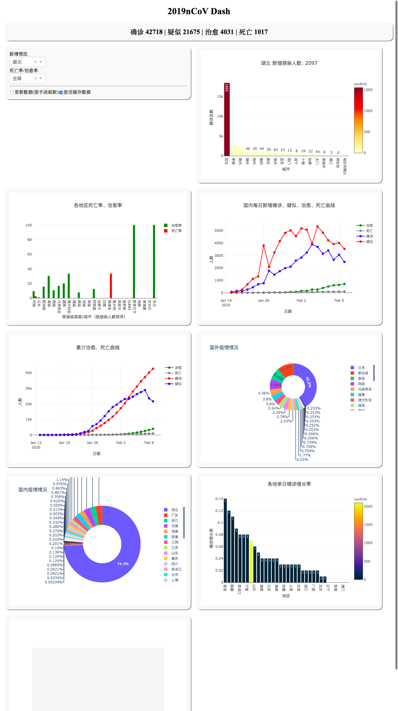

获取 nCoV2019 统计数据；

[TOC]

---

## 获取数据

| 属性/方法       | 数据               |
| --------------- | ------------------ |
| `.qq_source()`  | 使用QQ news数据    |
| `.data_url`     | 数据来源URL        |
| `.chinaDayList` | 国内每日通报       |
| `.chinaDayADD`  | 国内每日新增通报   |
| `.global_area`  | 全球地区数据       |
| `.china`        | 国内各省数据       |
| `.get()`        | 获取制定地区数据   |
| `.search('')`   | 有记录地区名称查询 |
|                 |                    |


## Example

```python
import nCoV2019
nCov = nCoV2019.qq_source()
```

```
截止 2020-02-04 11:02:52; 2019nCoV 已蔓延 23 个国家/地区
中国累计 20471 例确诊，自昨日00:00新增3266
```


```python
# 获取卫健委每日通报
nCov.chinaDayList
# 卫健委每日新增通报
nCov.chinaDayADD
```


```python
# 全球数据
nCov.global_area
```


`.get()`  对省级地区返回省级统计以及辖区各市数据

```python
# 省/市数据
nCov.get("湖北") # 返回湖北省总计和省内城市数据
nCov.get("武汉") # 返回湖北城市统计数据
```

<table border="1" class="dataframe">
  <thead>
    <tr style="text-align: right;">
      <th></th>
      <th>city</th>
      <th>confirm</th>
      <th>suspect</th>
      <th>dead</th>
      <th>heal</th>
      <th>confirm_add</th>
      <th>suspect_add</th>
      <th>dead_add</th>
      <th>heal_add</th>
    </tr>
  </thead>
  <tbody>
    <tr>
      <th>0</th>
      <td>武汉</td>
      <td>6384</td>
      <td>0</td>
      <td>313</td>
      <td>303</td>
      <td>1242</td>
      <td>0</td>
      <td>48</td>
      <td>79</td>
    </tr>
  </tbody>
</table>


使用 `search` 方法进行地名查询：

```python
nCov.search('六')
```


    ['兵团第六师五家渠市', '六盘水', '六安']

部分地名带行政单位，比如"丽江"，"丽江市"，可以用search 来确定。

```python
# 地名查询，部分地名带行政单位
# eg: 丽江 vs 丽江市
nCov.search('丽江')
```


    ['丽江市']




